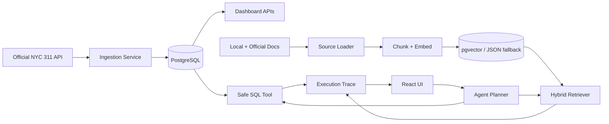

# CivicOps Agent

Urban service request analytics, safe SQL, hybrid RAG, and traceable agent workflow for NYC 311 operations.

[Live App](https://ririan1125.github.io/civicops-agent/) | [Live API Docs](https://civicops-agent-api-ririan1125.onrender.com/docs) | [Deploy Backend on Render](https://render.com/deploy?repo=https://github.com/ririan1125/civicops-agent)

## What This System Does

CivicOps Agent helps analyze NYC 311 service request operations. It has two knowledge paths:

1. SQL path for structured operational data.
2. RAG path for policy, process, metadata, and project architecture documents.

The system imports real NYC 311 records from the official NYC Open Data API, stores cleaned records in PostgreSQL, answers metric questions with a read-only SQL tool, answers document questions with hybrid RAG, and records execution traces for inspection.

## 中文说明

CivicOps Agent 是一个城市服务请求运营分析系统。它不是普通聊天机器人，而是把真实 NYC 311 数据、SQL 分析、官方文档 RAG、工具路由、人工复核边界和执行 trace 放在同一个工作台里。

它主要解决两类问题：

- 数据问题：例如投诉最多的类型是什么、哪个区请求最多、还有多少未关闭请求、哪个 agency 工作量最大、最近数据更新到哪一天。
- 文档/流程问题：例如 NYC311 服务请求状态怎么查、某类投诉应该看哪篇官方文章、Open Data 字段是什么意思、系统为什么只允许 SELECT、什么时候需要人工审批、RAG 证据不足时怎么处理。

## Live Deployment

Frontend:

```text
https://ririan1125.github.io/civicops-agent/
```

Backend:

```text
https://civicops-agent-api-ririan1125.onrender.com
```

The backend runs on Render's free tier, so the first request after inactivity can take extra time while the service wakes up.

## Architecture



Detailed architecture: [docs/ARCHITECTURE.md](docs/ARCHITECTURE.md)

## SQL Data Pipeline

The SQL pipeline handles structured NYC 311 rows.

Flow:

```text
NYC Open Data API
  -> fetch JSON records
  -> clean fields
  -> upsert by unique_key
  -> PostgreSQL service_requests table
  -> dashboard and SQL agent queries
```

Core fields:

- `unique_key`
- `created_date`
- `closed_date`
- `agency`
- `agency_name`
- `complaint_type`
- `descriptor`
- `location_type`
- `incident_zip`
- `borough`
- `status`
- `resolution_description`
- `latitude`
- `longitude`
- `raw_payload`

The SQL agent can use a DeepSeek schema-aware planner when configured. Without an API key, it uses deterministic safe templates. Either way, the backend validates SQL before execution.

SQL safety rules:

- only one `SELECT` statement is allowed;
- destructive keywords are blocked;
- comments and multiple statements are blocked;
- row listing queries get a default `LIMIT`;
- execution goes through SQLAlchemy;
- every run is traced.

## Data Freshness

NYC 311 data changes every day. The system supports:

- manual import with `POST /ingestion/run`;
- incremental sync with `POST /ingestion/sync-latest`;
- daily GitHub Actions sync against the live Render backend.

Incremental sync checks the latest `created_date` already stored, looks back a configurable number of days, fetches recent official records again, and upserts by `unique_key`. This captures both new service requests and recent status changes.

Default sync settings:

```text
INGESTION_SYNC_LIMIT=5000
INGESTION_SYNC_LOOKBACK_DAYS=7
```

Important boundary: this can stay current with the public NYC Open Data source, but it cannot be more real-time than the upstream dataset update cadence.

## RAG Document Pipeline

The RAG pipeline handles unstructured and semi-structured documents.

Flow:

```text
Local project docs + local multimodal assets + official NYC311/Open Data sources
  -> official NYC311 article discovery
  -> HTML/PDF/JSON/image source loading
  -> markdown-like text normalization
  -> heading-aware chunking
  -> embeddings
  -> pgvector-first vector retrieval with JSON fallback
  -> BM25 + vector + graph hybrid retrieval
  -> query expansion, MMR grouping, and reranking
  -> evidence gate
  -> grounded answer with citations
```

Current source categories:

- local operating policy docs in `sample_data/policies/`;
- project architecture docs in `docs/`;
- local PDF and image assets in `sample_data/rag_assets/`;
- official NYC311 service request and status pages;
- official NYC311 `article/?kanumber=KA-xxxxx` pages discovered from the NYC311 report-problems directory;
- official NYC 311 dataset metadata from Socrata;
- official NYC Open Data Technical Standards Manual pages;
- optional official NYC Open Data PDF sources when the city host allows backend download.

The official PDF host can return 403 to automated backend clients. For stability, the system indexes the official GitHub Pages version of the Technical Standards Manual and keeps PDF URLs as optional sources. If the PDF fetch succeeds, extracted PDF text is indexed too.

Local multimodal assets are supported through `sample_data/rag_assets/`:

- text-layer PDFs are extracted with `pypdf`;
- image files can be made searchable with sidecar OCR/caption files such as `image.png.txt`, `image.png.ocr.txt`, or `image.png.caption.md`;
- if `Pillow` and `pytesseract` are available in the runtime, image OCR is attempted;
- image-only files without OCR/caption text are indexed with an extraction-status note, but they will not retrieve well until OCR or caption text is provided.

The default live reindex crawls up to 120 official NYC311 article pages. This is controlled by:

```text
RAG_MAX_311_ARTICLES=120
RAG_REMOTE_CONCURRENCY=6
```

Retrieval is not direct context stuffing. The backend computes query expansion, BM25 lexical scores, vector cosine scores, source-aware bonuses, knowledge-graph entity bonuses, and a reranked hybrid score before sending evidence to the chat model. PostgreSQL deployments use `rag_vector_embeddings` with pgvector/HNSW for vector recall; SQLite or uninitialized deployments fall back to JSON vectors and application-side cosine.

Chinese questions also get query-expansion terms for common NYC311 concepts such as service request status, complaints, Open Data metadata, and SQL safety.

RAG answers return answer text, citations, source URL, chunk id, heading, snippet, hybrid score, vector score, vector backend, lexical score, graph entities, matched terms, confidence, generation provider, and trace id.

## Agent Routing

The planner chooses one of three routes:

- `safe_sql_analysis` for structured metrics, counts, rankings, status breakdowns, boroughs, agencies, and trends.
- `rag_policy_assistant` for policy, process, FAQ, metadata, source, governance, and project architecture questions.
- `clarification` when the request is ambiguous.

Examples:

```text
What are the top complaint types?
```

This should route to SQL.

```text
How do I check a NYC311 service request status?
```

This should route to RAG.

## Key API Endpoints

| Endpoint | Purpose |
| --- | --- |
| `GET /health` | Backend health check |
| `POST /ingestion/run` | Import official NYC 311 records |
| `POST /ingestion/sync-latest` | Incrementally sync new/recent NYC 311 records |
| `GET /dashboard/summary` | Dashboard metrics and data freshness |
| `POST /agent/sql` | Natural-language SQL analysis |
| `POST /agent/route` | Agent tool routing and execution |
| `GET /rag/sources` | List configured official remote RAG sources |
| `POST /rag/reindex` | Rebuild local and official document index |
| `POST /rag/reindex/jobs` | Start a background RAG rebuild job for production-safe refresh |
| `GET /rag/reindex/jobs/{job_id}` | Check background RAG rebuild status |
| `GET /rag/reindex/jobs/latest` | Check the latest background RAG rebuild job |
| `POST /rag/ask` | Hybrid RAG question answering |
| `POST /rag/vector-store/init` | PostgreSQL pgvector table, backfill, and HNSW index initialization |
| `GET /rag/vector-store/schema` | Show RAG collection, physical table, index, dimensions, and logical partitions |
| `GET /rag/knowledge-graph` | Show lightweight entity graph built from indexed chunks |
| `GET /traces` | Execution trace history |
| `POST /evals/run` | SQL/RAG evaluation suite |
| `POST /evals/rag-retrieval` | Retrieval Recall@K and MRR evaluation |
| `POST /evals/embedding-benchmark` | Vector-only benchmark for the currently indexed embedding model |

## Local Development

Backend:

```powershell
cd "D:\Backup\Documents\agent开发\backend"
python -m venv .venv
.\.venv\Scripts\python -m pip install -r requirements.txt
copy .env.example .env
.\.venv\Scripts\python -m uvicorn app.main:app --reload
```

Frontend:

```powershell
cd "D:\Backup\Documents\agent开发\frontend"
npm install
npm run dev
```

Docker:

```powershell
cd "D:\Backup\Documents\agent开发"
copy backend\.env.example backend\.env
docker compose up --build
```

Open:

- Frontend: http://localhost:3000
- Backend docs: http://localhost:8000/docs
- Health: http://localhost:8000/health

## Useful Commands

Run backend tests:

```powershell
cd "D:\Backup\Documents\agent开发\backend"
.\.venv\Scripts\python -m pytest -q
```

Refresh official RAG sources locally with the synchronous endpoint:

```powershell
curl -X POST http://localhost:8000/rag/reindex `
  -H "Content-Type: application/json" `
  -d "{\"include_remote\":true,\"max_311_articles\":120}"
```

Refresh official RAG sources in deployment-safe background mode:

```powershell
$job = curl.exe -s -X POST http://localhost:8000/rag/reindex/jobs `
  -H "Content-Type: application/json" `
  -d "{\"include_remote\":true,\"max_311_articles\":120}" | ConvertFrom-Json
curl.exe http://localhost:8000/rag/reindex/jobs/$($job.id)
```

Initialize pgvector locally on PostgreSQL:

```powershell
curl -X POST http://localhost:8000/rag/vector-store/init
```

Sync latest 311 data locally:

```powershell
curl -X POST http://localhost:8000/ingestion/sync-latest `
  -H "Content-Type: application/json" `
  -d "{\"limit\":5000,\"lookback_days\":7}"
```

## LLM and Embeddings

Default local mode:

```text
LLM_PROVIDER=mock
EMBEDDING_PROVIDER=bge
EMBEDDING_MODEL=BAAI/bge-small-en-v1.5
```

Production-like mode:

```text
LLM_PROVIDER=deepseek
DEEPSEEK_API_KEY=your_key_here
EMBEDDING_PROVIDER=bge
EMBEDDING_MODEL=BAAI/bge-small-en-v1.5
```

Never commit real API keys.

The deployed RAG pipeline uses the open-source BGE model through FastEmbed/ONNX, not the old deterministic hash vectors. `local_hash` remains only as a fast deterministic test fallback. For larger production semantic retrieval, you can still configure an OpenAI-compatible embedding endpoint that hosts a stronger open-source model such as BGE-M3.

Embedding comparison flow:

```text
1. Set EMBEDDING_PROVIDER / EMBEDDING_MODEL when testing another model.
2. Run POST /rag/reindex/jobs and wait for success, or use POST /rag/reindex for local synchronous rebuilds.
3. Run POST /evals/rag-retrieval for the full hybrid retrieval score.
4. Run POST /evals/embedding-benchmark for vector-only current-model comparison.
5. Compare Recall@1, Recall@3, Recall@5, MRR, latency, and cost across runs.
```

## pgvector Store

PostgreSQL deployments can initialize a pgvector mirror table:

```text
POST /rag/vector-store/init
```

This creates:

```text
rag_vector_embeddings
- chunk_id
- provider
- model
- dimensions
- embedding vector(...)
- metadata JSONB
```

It also creates an HNSW cosine index:

```sql
USING hnsw (embedding vector_cosine_ops)
```

When this table exists, the retriever uses pgvector for vector recall and keeps BM25, graph bonuses, and MMR reranking in the application layer. When pgvector is unavailable, it automatically falls back to JSON vector scoring.

Inspect the active store:

```text
GET /rag/vector-store/schema
```

The live deployment also has a GitHub Actions workflow at `.github/workflows/daily-data-sync.yml`:

- daily: `POST /ingestion/sync-latest` to upsert new/recent NYC 311 rows;
- weekly: `POST /rag/reindex/jobs`, polling `GET /rag/reindex/jobs/{job_id}`, then `POST /rag/vector-store/init` to refresh official documents and pgvector rows.

## Current Boundaries

- No production authentication yet.
- Public admin-like endpoints are acceptable for this demo, but should be protected before real use.
- PostgreSQL deployments use pgvector when initialized; local SQLite development uses JSON vectors as fallback.
- Multimodal support currently means text extraction from PDFs plus OCR/caption text ingestion for images; true image embeddings require a multimodal embedding provider.
- RAG reindex supports both synchronous local rebuilds and background rebuild jobs for deployed environments.
- Render free tier can sleep.
- The system can stay fresh with NYC Open Data, but cannot exceed the upstream update cadence.

Detailed RAG implementation notes in Chinese: [docs/ADVANCED_RAG_IMPLEMENTATION_CN.md](docs/ADVANCED_RAG_IMPLEMENTATION_CN.md).
