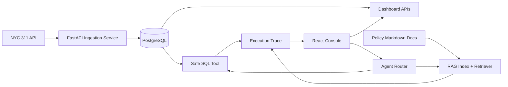

# CivicOps Agent

**Urban Service Request Triage & Operations Copilot**

CivicOps Agent is a full-stack operations copilot for exploring, analyzing, and auditing city service request workflows with real public data.

CivicOps Agent 是一个基于真实 NYC 311 城市服务请求数据的城市运营助手。项目重点是完整工程闭环：真实数据接入、指标分析、安全问数、RAG 文档问答、执行追踪和可复现部署。

## What It Does

- Imports real NYC 311 service request data from the official NYC Open Data API.
- Cleans and stores records in PostgreSQL.
- Shows operations dashboard metrics in React.
- Answers natural-language data questions through a safe read-only SQL agent.
- Answers policy/process questions through a local RAG assistant with citations.
- Records execution traces for SQL/RAG/tool actions.
- Runs basic evaluation suites for SQL safety and RAG citation/refusal behavior.
- Ships with Docker Compose for a reproducible demo.

## 项目功能

- 从官方 NYC Open Data API 接入真实 NYC 311 服务请求数据。
- 清洗数据并写入 PostgreSQL。
- 用 React 展示城市运营 dashboard。
- 支持自然语言问数，并生成只读 SQL。
- 用 SQL safety guard 阻止 `DELETE`、`DROP`、`UPDATE` 等危险语句。
- 用 RAG 回答政策/流程问题，并返回 citations。
- 记录 Agent execution trace，便于 debug、审计和评估。
- 内置 eval cases，评估 SQL safety 和 RAG citation/refusal。
- 使用 Docker Compose 一键启动前端、后端和数据库。

## Tech Stack

| Layer | Stack |
| --- | --- |
| Backend | Python, FastAPI, Pydantic, SQLAlchemy |
| Database | PostgreSQL in Docker, SQLite fallback for local tests |
| Frontend | React, TypeScript, Vite |
| Data | NYC 311 Service Requests API |
| Agent | Tool routing, safe SQL tool, execution traces |
| RAG | Markdown policy docs, chunking, retrieval, citations, refusal |
| Evaluation | JSON eval cases, SQL safety pass rate, RAG citation/refusal rate |
| Deployment | Docker Compose |

## Architecture



## Quick Start With Docker

Prerequisites:

- Docker Desktop
- Git

Run:

```powershell
git clone https://github.com/ririan1125/civicops-agent.git
cd civicops-agent
copy .env.example .env
docker compose up --build
```

Open:

- Frontend: http://localhost:3000
- Backend API docs: http://localhost:8000/docs
- Health check: http://localhost:8000/health

## Docker 快速启动

前置条件：

- 已安装 Docker Desktop
- 已安装 Git

运行：

```powershell
git clone https://github.com/ririan1125/civicops-agent.git
cd civicops-agent
copy .env.example .env
docker compose up --build
```

打开：

- 前端页面：http://localhost:3000
- 后端 API 文档：http://localhost:8000/docs
- 健康检查：http://localhost:8000/health

## Local Development

Backend:

```powershell
cd backend
python -m venv .venv
.\.venv\Scripts\python -m pip install -r requirements.txt
copy .env.example .env
.\.venv\Scripts\python -m uvicorn app.main:app --reload
```

Frontend:

```powershell
cd frontend
npm install
npm run dev
```

Run tests:

```powershell
cd backend
.\.venv\Scripts\python -m pytest -q
```

## Demo Flow

1. Open the dashboard.
2. Import 1,000 to 3,000 NYC 311 records.
3. Review total requests, open/closed counts, top complaint types, borough distribution, agency workload, and daily trend.
4. Ask the SQL Agent:

```text
What are the top complaint types?
```

5. Reindex RAG docs and ask:

```text
What SQL statements is the agent allowed to execute?
```

6. Open traces to inspect tool input, output, route, status, and latency.
7. Run evals to see SQL safety and RAG citation/refusal metrics.

Detailed script: [docs/DEMO_SCRIPT.md](docs/DEMO_SCRIPT.md)

## Key API Endpoints

| Endpoint | Purpose |
| --- | --- |
| `GET /health` | Backend health check |
| `POST /ingestion/run` | Import real NYC 311 records |
| `GET /dashboard/summary` | Dashboard metrics |
| `POST /agent/sql` | Natural-language SQL analysis |
| `POST /agent/route` | Route a question to SQL/RAG/clarification |
| `POST /rag/reindex` | Index local policy documents |
| `POST /rag/ask` | RAG question answering with citations |
| `GET /traces` | List execution traces |
| `POST /evals/run` | Run SQL/RAG evaluation cases |

## RAG System

The RAG assistant indexes markdown documents in `sample_data/policies/`.

Pipeline:

1. Parse local markdown policy/process documents.
2. Chunk documents by heading and size.
3. Retrieve relevant chunks with lexical scoring.
4. Answer only when evidence is strong enough.
5. Return citations with document title, chunk ID, section heading, snippet, and score.
6. Refuse weak-evidence questions instead of guessing.

Optional DeepSeek support:

- Default mode is `LLM_PROVIDER=mock`, so the demo runs without an API key.
- To use DeepSeek for evidence-grounded answer generation, set:

```text
LLM_PROVIDER=deepseek
DEEPSEEK_API_KEY=your_key_here
```

Never commit real keys. Keep them only in `.env`.

## Safe SQL Agent

The SQL agent is intentionally conservative.

Flow:

1. User asks a natural-language metrics question.
2. Deterministic planner maps it to a known read-only SQL pattern.
3. SQL safety guard validates that it is a single `SELECT`.
4. Dangerous statements are blocked.
5. Query executes through SQLAlchemy.
6. Results, generated SQL, assumptions, confidence, and trace ID are returned.

This design is safer for reproducible demos than allowing an LLM to generate arbitrary SQL directly.

## Evaluation

Evaluation files live in `evals/`.

- `sql_safety_cases.json`: verifies that allowed SELECT queries pass and destructive SQL is blocked.
- `rag_cases.json`: verifies citation behavior and weak-evidence refusal.

Run from the UI or API:

```powershell
curl -X POST http://localhost:8000/evals/run
```

## Security Notes

- Real API keys must stay in `.env`.
- `.env` is ignored by Git.
- `.env.example` contains placeholders only.
- SQL execution is read-only.
- Agent actions are traced.
- RAG refuses when evidence is weak.

## Project Structure

```text
backend/
  app/
    api/              FastAPI routes
    core/             settings
    db/               SQLAlchemy models/session
    schemas/          Pydantic schemas
    services/         ingestion, dashboard, SQL agent, RAG, evals, tracing
  tests/
frontend/
  src/                React console
sample_data/policies/ RAG policy docs
evals/                SQL/RAG eval cases
docs/                 project overview and demo docs
docker-compose.yml
```

## Current Scope

Implemented:

- Backend API
- Real data ingestion
- Dashboard metrics
- Safe SQL Agent
- RAG assistant
- Execution traces
- Evaluation runner
- React UI
- Docker Compose
- Tests and README

Intentional MVP boundaries:

- SQL planning is deterministic and safety-first.
- RAG uses local markdown docs and lexical retrieval for reproducible demos.
- DeepSeek is optional and read from environment only.
- Production auth, queue workers, cloud deployment, and advanced reranking are future extensions.
