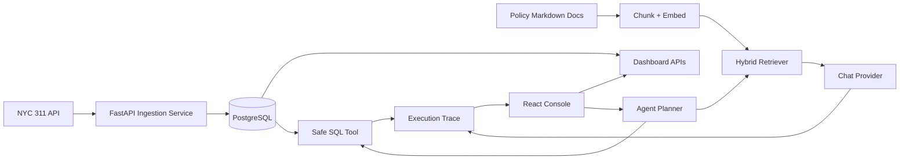

# CivicOps Agent

**Urban Service Request Triage & Operations Copilot**

[Live App](https://ririan1125.github.io/civicops-agent/) · [Live API](https://civicops-agent-api-ririan1125.onrender.com/docs) · [Deploy Backend on Render](https://render.com/deploy?repo=https://github.com/ririan1125/civicops-agent)

CivicOps Agent is a full-stack operations copilot for city service request teams. It imports real NYC 311 data, answers operational metric questions with a safe SQL tool, answers policy/process questions with hybrid RAG, and records every tool run for auditability.

CivicOps Agent 是一个基于真实 NYC 311 城市服务请求数据的城市运营助手。它解决的问题是：运营人员需要快速看清投诉趋势、区域分布、部门工作量和处理流程依据，同时系统必须保证 SQL 只读、回答可引用、执行过程可追踪。

## What It Does

- Imports real NYC 311 service request data from the official NYC Open Data API.
- Cleans and stores records in PostgreSQL.
- Shows operations dashboard metrics in React.
- Plans and executes natural-language metric questions through a read-only SQL tool.
- Routes user questions through an agent planner that selects SQL, RAG, or clarification.
- Answers policy/process questions through hybrid vector/keyword RAG with citations.
- Records execution traces for SQL/RAG/tool actions.
- Runs basic evaluation suites for SQL safety and RAG citation/refusal behavior.
- Ships with Docker Compose for a reproducible demo.

## 项目功能

- 从官方 NYC Open Data API 接入真实 NYC 311 服务请求数据。
- 清洗数据并写入 PostgreSQL。
- 用 React 展示城市运营 dashboard。
- 用 Agent planner 判断问题应该走 SQL、RAG，还是需要澄清。
- 支持自然语言问数，并通过安全 SQL 工具执行只读查询。
- 用 SQL safety guard 阻止 `DELETE`、`DROP`、`UPDATE` 等危险语句。
- 用 hybrid RAG 回答政策/流程问题，并返回 citations、vector score、lexical score。
- 记录 Agent execution trace，便于 debug、审计和评估。
- 内置 eval cases，评估 SQL safety 和 RAG citation/refusal。
- 使用 Docker Compose 一键启动前端、后端和数据库。

## Tech Stack

| Layer | Stack |
| --- | --- |
| Backend | Python, FastAPI, Pydantic, SQLAlchemy |
| Database | PostgreSQL in Docker, SQLite fallback for local tests |
| Frontend | React, TypeScript, Vite |
| Data | NYC 311 Service Requests API |
| Agent | Structured planner, tool registry, SQL/RAG/clarification tools, execution traces |
| RAG | Markdown policy docs, chunking, embeddings, hybrid retrieval, grounded generation, citations, refusal |
| Evaluation | JSON eval cases, SQL safety pass rate, RAG citation/refusal/evidence hit rate |
| Deployment | Docker Compose |

## Architecture



## Quick Start With Docker

Prerequisites:

- Docker Desktop
- Git

Run:

```powershell
git clone https://github.com/ririan1125/civicops-agent.git
cd civicops-agent
copy .env.example .env
docker compose up --build
```

Open:

- Frontend: http://localhost:3000
- Backend API docs: http://localhost:8000/docs
- Health check: http://localhost:8000/health

## Live Deployment

The public frontend is deployed with GitHub Pages:

```text
https://ririan1125.github.io/civicops-agent/
```

The live backend is deployed on Render:

```text
https://civicops-agent-api-ririan1125.onrender.com
```

The public frontend calls the Render FastAPI service, which uses PostgreSQL and can ingest real NYC 311 records. The backend runs on Render's free instance type, so the first request after inactivity can take extra time while the service wakes up.

## Cloud Backend Deployment

The repository includes `render.yaml` for deploying the FastAPI backend and PostgreSQL database on Render.

One-click deploy:

[Deploy Backend on Render](https://render.com/deploy?repo=https://github.com/ririan1125/civicops-agent)

Current backend URL:

```text
https://civicops-agent-api-ririan1125.onrender.com
```

The GitHub Pages workflow builds the frontend with:

```text
VITE_API_BASE_URL=https://civicops-agent-api-ririan1125.onrender.com
```

If the backend URL changes, update `.github/workflows/deploy-pages.yml` or set the GitHub repository variable `VITE_API_BASE_URL`, then rerun the workflow.

## Docker 快速启动

前置条件：

- 已安装 Docker Desktop
- 已安装 Git

运行：

```powershell
git clone https://github.com/ririan1125/civicops-agent.git
cd civicops-agent
copy .env.example .env
docker compose up --build
```

打开：

- 前端页面：http://localhost:3000
- 后端 API 文档：http://localhost:8000/docs
- 健康检查：http://localhost:8000/health

## Local Development

Backend:

```powershell
cd backend
python -m venv .venv
.\.venv\Scripts\python -m pip install -r requirements.txt
copy .env.example .env
.\.venv\Scripts\python -m uvicorn app.main:app --reload
```

Frontend:

```powershell
cd frontend
npm install
npm run dev
```

Run tests:

```powershell
cd backend
.\.venv\Scripts\python -m pytest -q
```

## Demo Flow

1. Open the dashboard.
2. Import 1,000 to 3,000 NYC 311 records.
3. Review total requests, open/closed counts, top complaint types, borough distribution, agency workload, and daily trend.
4. Open Agent Run and ask a routed question:

```text
What policy explains allowed SQL statements?
```

5. Ask the SQL tool directly:

```text
What are the top complaint types?
```

6. Reindex RAG docs and ask:

```text
What SQL statements is the agent allowed to execute?
```

7. Open traces to inspect planner output, selected tool, tool input, output, route, status, and latency.
8. Run evals to see SQL safety and RAG citation/refusal/evidence metrics.

Detailed script: [docs/DEMO_SCRIPT.md](docs/DEMO_SCRIPT.md)

## Key API Endpoints

| Endpoint | Purpose |
| --- | --- |
| `GET /health` | Backend health check |
| `POST /ingestion/run` | Import real NYC 311 records |
| `GET /dashboard/summary` | Dashboard metrics |
| `POST /agent/sql` | Natural-language SQL analysis |
| `POST /agent/route` | Plan a tool call and route to SQL/RAG/clarification |
| `POST /rag/reindex` | Index local policy documents and write chunk embeddings |
| `POST /rag/ask` | Hybrid RAG question answering with citations |
| `GET /traces` | List execution traces |
| `POST /evals/run` | Run SQL/RAG evaluation cases |

## RAG System

The RAG assistant indexes markdown documents in `sample_data/policies/`.

Pipeline:

1. Parse local markdown policy/process documents.
2. Chunk documents by heading and size.
3. Generate and store one embedding per chunk.
4. Retrieve candidate chunks with hybrid vector/keyword scoring.
5. Rerank with vector score, lexical overlap, heading match, and phrase match.
6. Gate weak evidence before generation.
7. Call the configured chat provider to generate a grounded answer from retrieved evidence.
8. Return citations with document title, chunk ID, section heading, snippet, hybrid score, lexical score, vector score, and matched terms.
9. Refuse weak-evidence questions instead of guessing.

Default no-key mode:

- `LLM_PROVIDER=mock` uses a local mock chat provider so the app and tests run without secrets.
- `EMBEDDING_PROVIDER=local_hash` uses deterministic local hash embeddings so reindexing works without an embedding API.

Production-like mode:

- Set `LLM_PROVIDER=deepseek` and `DEEPSEEK_API_KEY` to use DeepSeek for planner/RAG answer generation.
- Set `EMBEDDING_PROVIDER=api`, `EMBEDDING_BASE_URL`, `EMBEDDING_API_KEY`, and `EMBEDDING_MODEL` to use an OpenAI-compatible embedding service.

Optional DeepSeek support:

- Default mode is `LLM_PROVIDER=mock`, so the demo runs without an API key.
- To use DeepSeek for evidence-grounded answer generation, set:

```text
LLM_PROVIDER=deepseek
DEEPSEEK_API_KEY=your_key_here
```

Never commit real keys. Keep them only in `.env`.

## Safe SQL Agent

The SQL tool is intentionally conservative.

Flow:

1. User asks a natural-language metrics question.
2. If DeepSeek is configured, a schema-aware planner may generate one JSON-structured SQL plan.
3. Without DeepSeek, deterministic templates provide a safe fallback.
4. SQL safety guard strips comments, blocks multiple statements, blocks destructive keywords, parses with `sqlglot`, and requires a single `SELECT`.
5. A default `LIMIT` is enforced for listing queries.
6. Query executes through SQLAlchemy.
7. Results, generated SQL, assumptions, confidence, and trace ID are returned.

This design allows LLM-assisted planning when configured, but backend validation still owns execution safety.

## Evaluation

Evaluation files live in `evals/`.

- `sql_safety_cases.json`: verifies that allowed SELECT queries pass, destructive SQL is blocked, and SQL comments do not bypass guards.
- `rag_cases.json`: verifies citation behavior, evidence-term hits, and weak-evidence refusal.

Run from the UI or API:

```powershell
curl -X POST http://localhost:8000/evals/run
```

## Security Notes

- Real API keys must stay in `.env`.
- `.env` is ignored by Git.
- `.env.example` contains placeholders only.
- SQL execution is read-only.
- Agent actions are traced.
- RAG refuses when evidence is weak.

## Project Structure

```text
backend/
  app/
    api/              FastAPI routes
    core/             settings
    db/               SQLAlchemy models/session
    schemas/          Pydantic schemas
    services/         ingestion, dashboard, SQL agent, RAG, evals, tracing
  tests/
frontend/
  src/
    api.ts            API client
    types.ts          Shared frontend types
    components/       Reusable UI pieces
    pages/            Dashboard, Agent Run, SQL Tool, Hybrid RAG, Traces, Evals
sample_data/policies/ RAG policy docs
evals/                SQL/RAG eval cases
docs/                 project overview and demo docs
docker-compose.yml
```

## Current Scope

Implemented:

- Backend API
- Real data ingestion
- Dashboard metrics
- Agent planner and tool registry
- Safe SQL tool with optional LLM planner and backend safety validation
- Hybrid RAG with chunk embeddings, hybrid retrieval, grounded generation, citations, and refusal
- Execution traces
- Evaluation runner
- React UI split into API/types/components/pages
- Docker Compose
- Tests and README

Intentional MVP boundaries:

- Default no-key mode uses mock chat generation and local hash embeddings; configure external providers for production-like LLM and embedding behavior.
- Vector search is database-backed JSON plus application-side cosine scoring, not pgvector yet.
- SQL execution is read-only and intentionally narrow.
- Production auth, queue workers, cloud deployment, document upload, pgvector, and learned reranking are future extensions.
