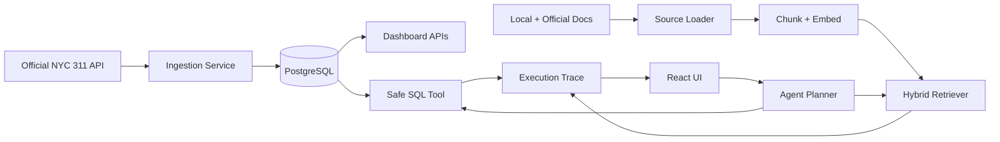

# CivicOps Agent

Urban service request analytics, safe SQL, hybrid RAG, and traceable agent workflow for NYC 311 operations.

[Live App](https://ririan1125.github.io/civicops-agent/) | [Live API Docs](https://civicops-agent-api-ririan1125.onrender.com/docs) | [Deploy Backend on Render](https://render.com/deploy?repo=https://github.com/ririan1125/civicops-agent)

## What This System Does

CivicOps Agent helps analyze NYC 311 service request operations. It has two knowledge paths:

1. SQL path for structured operational data.
2. RAG path for policy, process, metadata, and project architecture documents.

The system imports real NYC 311 records from the official NYC Open Data API, stores cleaned records in PostgreSQL, answers metric questions with a read-only SQL tool, answers document questions with hybrid RAG, and records execution traces for inspection.

## 中文说明

CivicOps Agent 是一个城市服务请求运营分析 Agent。它不是普通聊天机器人，而是把真实 NYC 311 数据、SQL 分析、官方文档 RAG、工具路由、执行 trace 放在同一个工作台里。

它主要解决两类问题：

- 数据问题：例如投诉最多的类型是什么、哪个区请求最多、还有多少未关闭请求、哪个部门工作量最大。
- 文档/流程问题：例如 NYC311 服务请求状态怎么查、系统允许什么 SQL、Open Data 字段是什么意思、什么时候需要人工复核、RAG 证据不足时怎么办。

## Live Deployment

Frontend:

```text
https://ririan1125.github.io/civicops-agent/
```

Backend:

```text
https://civicops-agent-api-ririan1125.onrender.com
```

The backend runs on Render's free tier, so the first request after inactivity can take extra time while the service wakes up.

## Architecture



Detailed architecture: [docs/ARCHITECTURE.md](docs/ARCHITECTURE.md)

## SQL Data Pipeline

The SQL pipeline handles structured NYC 311 rows.

Flow:

```text
NYC Open Data API
  -> fetch JSON records
  -> clean fields
  -> upsert by unique_key
  -> PostgreSQL service_requests table
  -> dashboard and SQL agent queries
```

Core fields:

- `unique_key`
- `created_date`
- `closed_date`
- `agency`
- `agency_name`
- `complaint_type`
- `descriptor`
- `location_type`
- `incident_zip`
- `borough`
- `status`
- `resolution_description`
- `latitude`
- `longitude`
- `raw_payload`

The SQL agent can use a DeepSeek schema-aware planner when configured. Without an API key, it uses deterministic safe templates. Either way, the backend validates SQL before execution.

SQL safety rules:

- only one `SELECT` statement is allowed;
- destructive keywords are blocked;
- comments and multiple statements are blocked;
- row listing queries get a default `LIMIT`;
- execution goes through SQLAlchemy;
- every run is traced.

## Data Freshness

NYC 311 data changes every day. The system supports:

- manual import with `POST /ingestion/run`;
- incremental sync with `POST /ingestion/sync-latest`;
- daily GitHub Actions sync against the live Render backend.

Incremental sync checks the latest `created_date` already stored, looks back a configurable number of days, fetches recent official records again, and upserts by `unique_key`. This captures both new service requests and recent status changes.

Default sync settings:

```text
INGESTION_SYNC_LIMIT=5000
INGESTION_SYNC_LOOKBACK_DAYS=7
```

Important boundary: this can stay current with the public NYC Open Data source, but it cannot be more real-time than the upstream dataset update cadence.

## RAG Document Pipeline

The RAG pipeline handles unstructured and semi-structured documents.

Flow:

```text
Local project docs + official NYC311/Open Data sources
  -> HTML/PDF/JSON source loading
  -> markdown-like text normalization
  -> heading-aware chunking
  -> embeddings
  -> hybrid vector/keyword retrieval
  -> evidence gate
  -> grounded answer with citations
```

Current source categories:

- local operating policy docs in `sample_data/policies/`;
- project architecture docs in `docs/`;
- official NYC311 service request and status pages;
- official NYC 311 dataset metadata from Socrata;
- official NYC Open Data Technical Standards Manual pages;
- optional official NYC Open Data PDF sources when the city host allows backend download.

The official PDF host can return 403 to automated backend clients. For stability, the system indexes the official GitHub Pages version of the Technical Standards Manual and keeps PDF URLs as optional sources. If the PDF fetch succeeds, extracted PDF text is indexed too.

RAG answers return:

- answer text;
- source citations;
- document title;
- source URL when available;
- chunk id;
- heading;
- snippet;
- hybrid score;
- vector score;
- lexical score;
- matched terms.

## Agent Routing

The planner chooses one of three routes:

- `safe_sql_analysis` for structured metrics, counts, rankings, status breakdowns, boroughs, agencies, and trends.
- `rag_policy_assistant` for policy, process, FAQ, metadata, source, governance, and project architecture questions.
- `clarification` when the request is ambiguous.

Examples:

```text
What are the top complaint types?
```

This should route to SQL.

```text
How do I check a NYC311 service request status?
```

This should route to RAG.

## Key API Endpoints

| Endpoint | Purpose |
| --- | --- |
| `GET /health` | Backend health check |
| `POST /ingestion/run` | Import official NYC 311 records |
| `POST /ingestion/sync-latest` | Incrementally sync new/recent NYC 311 records |
| `GET /dashboard/summary` | Dashboard metrics and data freshness |
| `POST /agent/sql` | Natural-language SQL analysis |
| `POST /agent/route` | Agent tool routing and execution |
| `GET /rag/sources` | List configured official remote RAG sources |
| `POST /rag/reindex` | Rebuild local and official document index |
| `POST /rag/ask` | Hybrid RAG question answering |
| `GET /traces` | Execution trace history |
| `POST /evals/run` | SQL/RAG evaluation suite |

## Local Development

Backend:

```powershell
cd D:\Backup\Documents\agent开发\backend
python -m venv .venv
.\.venv\Scripts\python -m pip install -r requirements.txt
copy .env.example .env
.\.venv\Scripts\python -m uvicorn app.main:app --reload
```

Frontend:

```powershell
cd D:\Backup\Documents\agent开发\frontend
npm install
npm run dev
```

Docker:

```powershell
cd D:\Backup\Documents\agent开发
copy .env.example .env
docker compose up --build
```

Open:

- Frontend: http://localhost:3000
- Backend docs: http://localhost:8000/docs
- Health: http://localhost:8000/health

## Useful Commands

Run backend tests:

```powershell
cd D:\Backup\Documents\agent开发\backend
.\.venv\Scripts\python -m pytest -q
```

Refresh official RAG sources locally:

```powershell
curl -X POST http://localhost:8000/rag/reindex `
  -H "Content-Type: application/json" `
  -d "{\"include_remote\":true}"
```

Sync latest 311 data locally:

```powershell
curl -X POST http://localhost:8000/ingestion/sync-latest `
  -H "Content-Type: application/json" `
  -d "{\"limit\":5000,\"lookback_days\":7}"
```

## LLM and Embeddings

Default no-key mode:

```text
LLM_PROVIDER=mock
EMBEDDING_PROVIDER=local_hash
```

Production-like mode:

```text
LLM_PROVIDER=deepseek
DEEPSEEK_API_KEY=your_key_here
EMBEDDING_PROVIDER=api
EMBEDDING_BASE_URL=your_embedding_base_url
EMBEDDING_API_KEY=your_embedding_key
```

Never commit real API keys.

## Current Boundaries

- No production authentication yet.
- Public admin-like endpoints are acceptable for this demo, but should be protected before real use.
- Vector storage uses JSON vectors and application-side cosine scoring; larger corpora should use pgvector or a vector database.
- Render free tier can sleep.
- The system can stay fresh with NYC Open Data, but cannot exceed the upstream update cadence.
